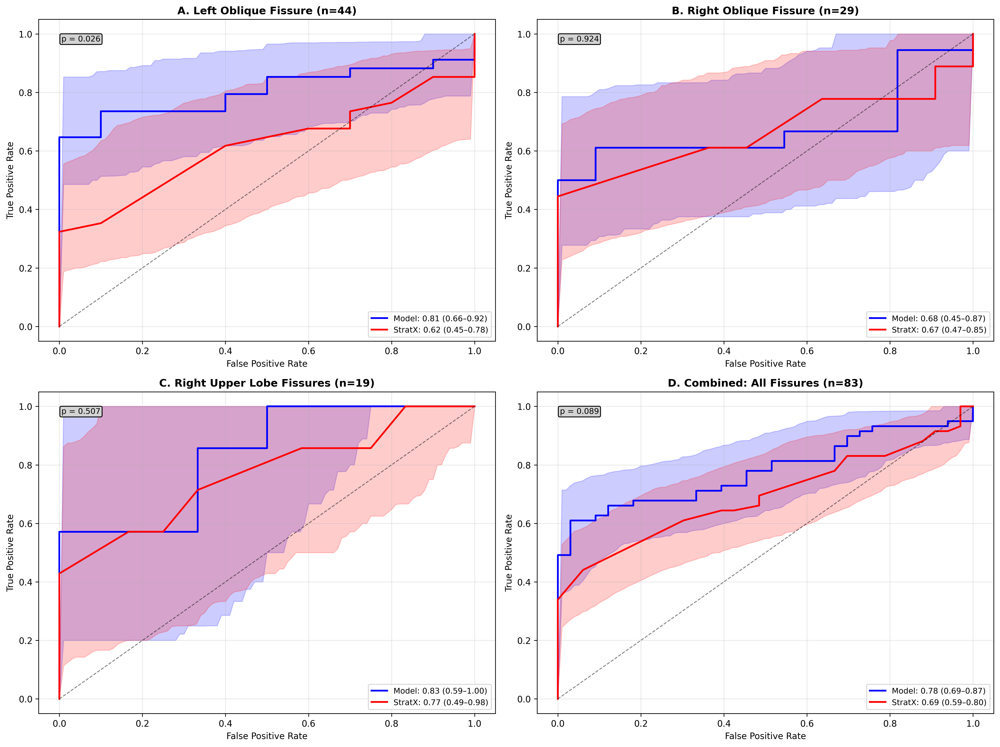
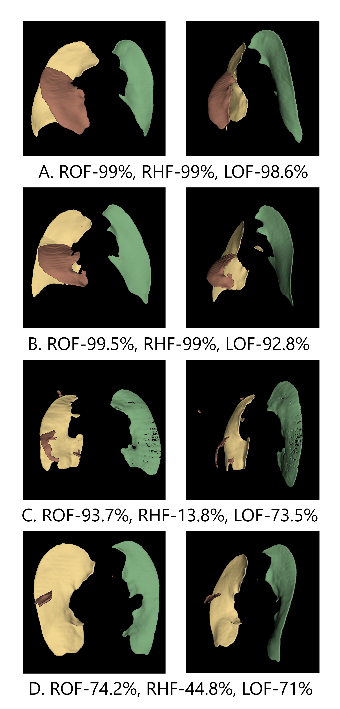

# Deep Learning–Based Quantification of Fissure Completeness in Preoperative CT

## Overview
This repository contains code and resources for an automated deep learning–based pipeline to quantify fissure completeness from CT scans of patients with severe emphysema.  
We trained and validated **nnU-Net v2** segmentation models to delineate lobar anatomy and fissures, enabling reproducible computation of fissure completeness scores for each fissure.  
Predicted scores were validated against StratX-derived fissure completeness values and evaluated for their ability to predict collateral ventilation (CV) status.

## Key Features
- **nnU-Net v2** segmentation model trained on preoperative CT scans to segment lobes and fissures.
- Automated computation of fissure completeness percentage for each fissure type (LOF, ROF, RHF).
- Validation against StratX-based fissure completeness from clinical reports.
- Evaluation using ROC analysis for CV prediction.

## Dataset
- **Internal Stanford cohort**: CT scans from 3 different clinical cohorts that included one cohort of severe emphysema along with a public Ottawa Chest CT lobe segmentation dataset.
- **Fissure types evaluated**: Left oblique, right oblique, right horizontal, and combined fissures.
- DICOMs converted to NIfTI format; preprocessing and postprocessing handled via nnU-Net pipeline and customized postprocessing.

## Model Performance
- **Segmentation performance**: High Dice similarity coefficients for lobar segmentation.
- **Fissure completeness prediction**:
  - Model AUROC for predicting CV negative status exceeded or matched StratX across fissure types (0.78 vs 0.69, p=0.09).
  - Statistically significant for predicting CV negative status across left oblique fissure (p = 0.026).

## Figures

  

  

## Model Checkpoints
Model checkpoints are available here.
10.6084/m9.figshare.29877704

## Citation
If you use this code or data, please cite our paper:

**[Full citation to be added upon publication]**
